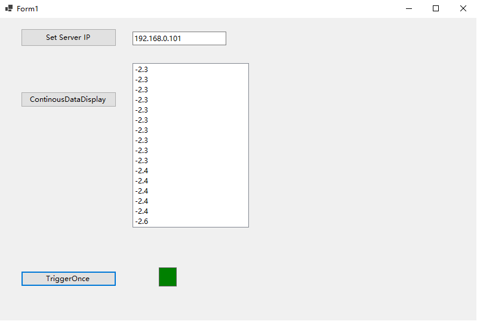

# RemoteSensorDataDisplay
People sometimes need to grab the data remotely. For example, sensors are far from the monitoring computer in the scope of smart agriculture. This project is to display the remote data via gRPC service in c# and dotnet framework. I use yocto-altimeter and yocto-servo as the testing sensors.

- PS: please don't set the server ip with "127.0.0.1" or "localhost". Use its IPV4 address, like "192.168.0.100", or you will not establish the communication with gRPC service.

